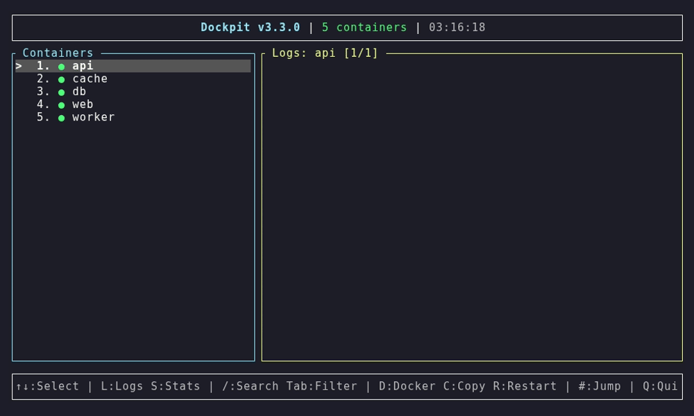
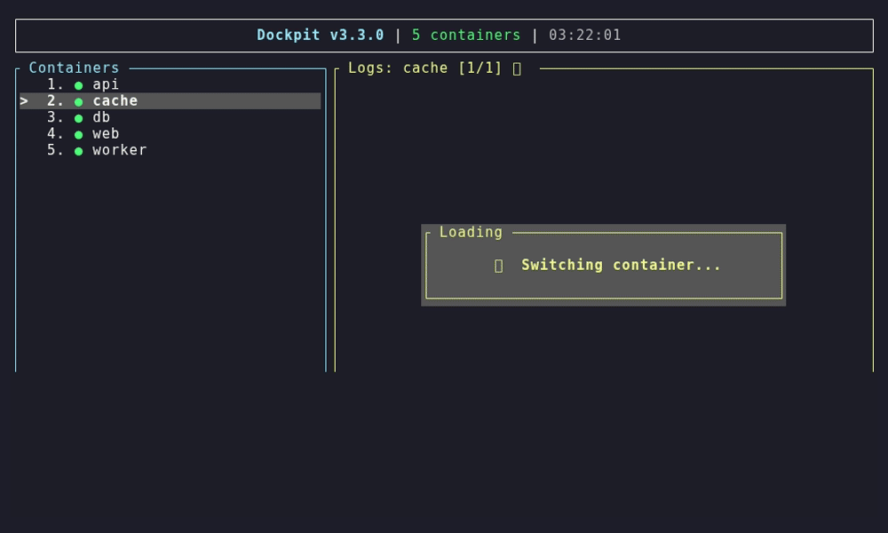
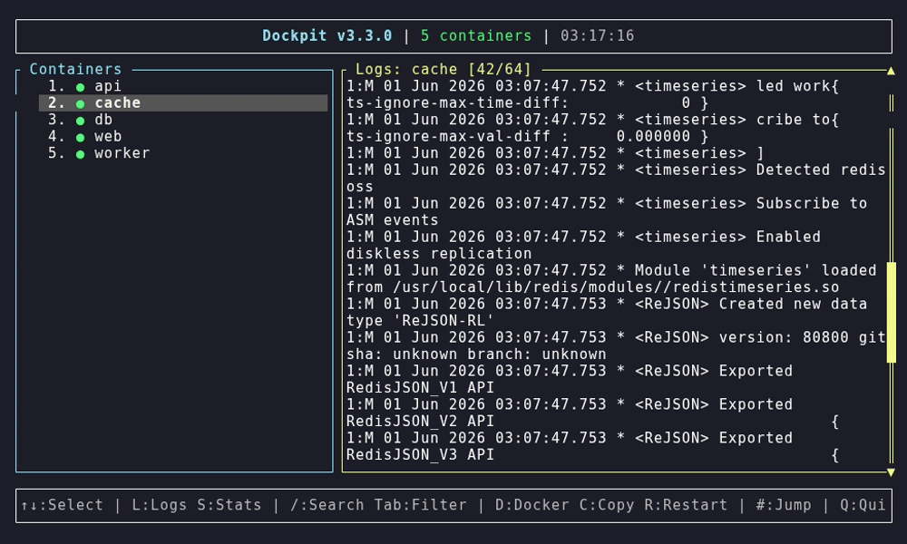
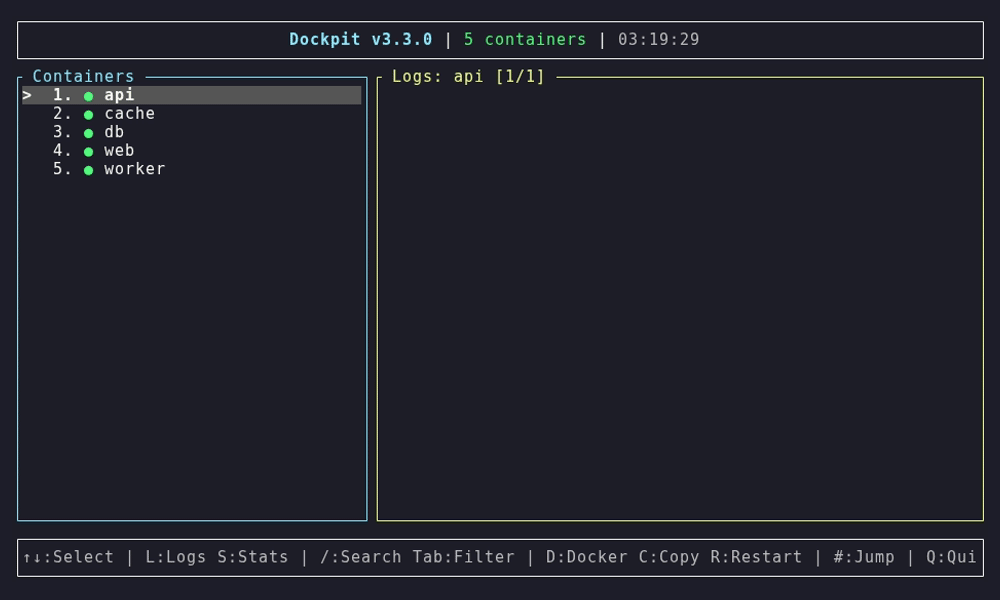
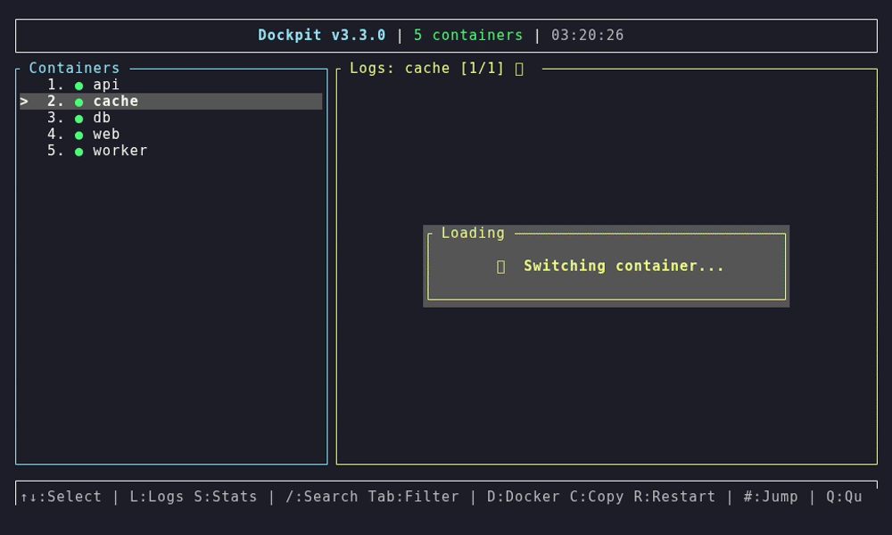

# Dockpit

[English](README.md) · [Español](README.es.md)

[](LICENSE)
[](https://www.rust-lang.org/)
[](#requisitos)

**Una interfaz de terminal rápida y sin parpadeos para gestionar contenedores Docker.**

Dockpit es un único binario estático que te da una vista en vivo y de doble panel
de tus contenedores: logs en streaming con scroll infinito y búsqueda,
estadísticas en tiempo real y el ciclo de vida completo de los contenedores sin
salir de la terminal. Está hecho en Rust sobre
[ratatui](https://github.com/ratatui/ratatui),
[bollard](https://github.com/fussybeaver/bollard) y Tokio, siguiendo la
arquitectura Elm (`Message → Update → View` unidireccional) para una UI que nunca
parpadea ni tiene fugas de memoria.



## Características

- **TUI de doble panel** — lista de contenedores a la izquierda, logs o estadísticas a la derecha, en tiempo real y sin parpadeos.
- **Control completo del ciclo de vida** — iniciar, detener, reiniciar, pausar, reanudar y eliminar contenedores desde un menú integrado.
- **Logs en vivo con scroll infinito** — al scrollear más allá del buffer visible se cargan los logs históricos bajo demanda, paginados por timestamp.
- **Búsqueda en logs** — `/` para buscar, `n`/`N` para saltar entre coincidencias, resaltadas en línea (insensible a mayúsculas en ASCII).
- **Filtrado por nivel** — cicla `All → Error → Warn → Info → Debug → Trace` con `Tab`; el scroll, la scrollbar y el título respetan el filtro.
- **Copiar y exportar** — copiá presets o el log completo al portapapeles, exportá a un archivo con timestamp, o imprimí en la terminal para selección manual.
- **Estadísticas en tiempo real** — CPU %, uso/límite de memoria, I/O de red y de disco.
- **Exec e inspección** — ejecutá comandos dentro de un contenedor desde la CLI.
- **Portapapeles compatible con SSH** — usa herramientas nativas en local y **OSC 52** sobre SSH, así copiar funciona incluso en un host remoto sin X11.
- **Modo CLI** — subcomandos scripteables (`list`, `start`, `stop`, `restart`, `logs`, `stats`, `exec`) además de la TUI interactiva.

## Recorrido de features

### Logs en vivo con niveles de color

Mirá los logs de un contenedor en tiempo real — `ERROR`/`WARN`/`INFO`/`DEBUG`
salen con color, y al scrollear más allá del tope se carga el historial más
viejo de forma transparente (infinite scroll).



### Búsqueda dentro de los logs

Apretá `/`, tipeá una consulta y saltá entre las coincidencias resaltadas con
`n`/`N`.



### Filtro por nivel de log

Ciclá el nivel visible con `Tab` — el título, la scrollbar y el conteo de líneas
siguen el filtro.


### Estadísticas en tiempo real

Cambiá a la vista de estadísticas con `S` para ver CPU, memoria, red y block I/O
en vivo.



### Operaciones de contenedor y portapapeles

`D` abre el menú de ciclo de vida (iniciar / detener / reiniciar / pausar /
reanudar / eliminar); `C` abre el menú del portapapeles (presets de copia,
exportar a archivo, o imprimir para SSH).



## Instalación

### Desde el código fuente (recomendado)

Requiere una toolchain estable reciente de [Rust](https://rustup.rs/).

```bash
git clone https://github.com/Corpy-ai/dockpit.git
cd dockpit
cargo build --release
./target/release/dockpit
```

### Con cargo install

```bash
cargo install --git https://github.com/Corpy-ai/dockpit
```

### Binario precompilado

Descargá el binario para tu plataforma desde la página de
[Releases](https://github.com/Corpy-ai/dockpit/releases) y ponelo en tu `PATH`:

```bash
sudo install -m 0755 dockpit /usr/local/bin/dockpit
```

## Uso

### TUI interactiva (por defecto)

```bash
dockpit
```

### Comandos CLI

```bash
dockpit list [--all]                     # lista contenedores (por defecto: solo en ejecución)
dockpit start   <contenedor>             # inicia un contenedor
dockpit stop    <contenedor>             # detiene un contenedor
dockpit restart <contenedor>             # reinicia un contenedor
dockpit logs    <contenedor> [--lines N] [--follow]
dockpit stats   [contenedor]             # estadísticas de recursos
dockpit exec    <contenedor> <comando...> # ejecuta un comando dentro del contenedor
```

## Atajos de teclado (TUI)

| Teclas | Acción |
|--------|--------|
| `↑` / `↓` o `j` / `k` | Mover la selección / scroll en logs |
| `←` / `→` o `h` | Cambiar el foco entre el panel de contenedores y el de logs |
| `1`–`9` (escribí un número) | Saltar directo al contenedor N |
| `L` | Vista de Logs |
| `S` | Vista de Estadísticas |
| `F` | Alternar logs a pantalla completa (expandido) |
| `/` | Buscar en logs (`Enter` salta, `n`/`N` siguiente/anterior, `Esc` cancela) |
| `Tab` | Ciclar el filtro por nivel (All/Error/Warn/Info/Debug/Trace) |
| `D` | Menú de operaciones Docker |
| `C` | Menú del portapapeles |
| `R` | Reiniciar el contenedor seleccionado |
| `PageUp` / `PageDown` | Scroll de logs de 10 líneas |
| `Home` / `End` | Ir al inicio / final de los logs |
| `Q` | Salir |

**Menú de operaciones Docker (`D`):** `1` Iniciar · `2` Detener · `3` Reiniciar · `4` Pausar · `5` Reanudar · `6` Eliminar · `Esc` cerrar.

**Menú del portapapeles (`C`):** `1` Últimas 100 líneas · `2` Últimas 500 líneas · `3` Líneas visibles · `4` Desde la posición actual al final · `5` Todos los logs · `6` Exportar a archivo · `7` Imprimir en la terminal · `Esc` cerrar.

## Copiar logs por SSH

Cuando ejecutás Dockpit en un host remoto vía SSH, las herramientas de
portapapeles del host remoto (`xclip`/`wl-copy`) no pueden llegar a *tu*
portapapeles. Hay tres opciones:

1. **Imprimir en la terminal — opción `7` (funciona en cualquier terminal).** La
   TUI vuelve al scrollback normal e imprime los logs (respetando el filtro de
   nivel activo). Seleccioná con el mouse y copiá con `Ctrl+Shift+C`; `Enter`
   vuelve a la TUI. La opción más confiable para grandes volúmenes.
2. **Selección nativa con el mouse.** Dockpit nunca captura el mouse, así que
   siempre podés seleccionar los logs visibles y copiar con `Ctrl+Shift+C`. Usá
   los logs expandidos (`F`) para una selección más limpia. Limitado a lo que está
   en pantalla.
3. **OSC 52 — opciones `1`–`6` del menú.** Emiten una secuencia de escape OSC 52
   que la terminal *local* intercepta y vuelca a tu portapapeles, atravesando SSH.
   Se autoselecciona sobre SSH; forzala con `DOCKPIT_CLIPBOARD=osc52` (o `=local`
   para el backend nativo).

> ⚠️ **GNOME Terminal / VTE no soporta OSC 52** (Tilix, xfce4-terminal, Ptyxis y
> Black Box también son VTE). Ahí usá la opción `7` o la selección nativa. OSC 52
> sí funciona en kitty, alacritty, wezterm, foot, ghostty, iTerm2 y Konsole (con
> "permitir que los programas escriban al portapapeles"). El passthrough de
> tmux/screen se envuelve automáticamente (tmux requiere `allow-passthrough on`,
> por defecto desde 3.3). El límite práctico de OSC 52 es ~100 KB — para más, usá
> la opción `7` o **Exportar** (`6`).

Verificá tu terminal:

```bash
printf '\033]52;c;%s\007' "$(printf 'osc52-works' | base64 -w0)"
# Pegá (Ctrl+V): si aparece "osc52-works", tu terminal soporta OSC 52.
```

## Requisitos

- **Docker** corriendo y accesible (el usuario debe estar en el grupo `docker` o usar `sudo`).
- Una terminal con soporte para 256 colores.
- Opcional: `xclip`/`xsel` (X11) o `wl-clipboard` (Wayland) para el backend de portapapeles nativo en Linux. macOS usa `pbcopy` sin configuración.

## Arquitectura

```
src/
├── main.rs              # Parseo de CLI (clap) + punto de entrada
├── app/                 # Arquitectura Elm
│   ├── message.rs       # Enum Message, LogEntry/LogLevel, parsing de logs
│   ├── state.rs         # AppState y todo el estado de vista/navegación/menú
│   ├── update.rs        # update(): Message → State → Effects (pura)
│   └── effects.rs       # EffectRunner: ejecuta side effects (Docker, portapapeles)
├── docker/mod.rs        # Cliente de la API de Docker (bollard): list/start/stop/logs/stats/exec
├── ui/
│   ├── mod.rs           # Event loop, setup de terminal, detección del backend de portapapeles
│   └── view.rs          # Render con ratatui (paneles, menús, highlight, scrollbar)
└── utils/
    ├── clipboard.rs     # Portapapeles multiplataforma (wl-copy/xclip/xsel/pbcopy/arboard)
    └── osc52.rs         # Portapapeles OSC 52 sobre SSH
```

El estado es inmutable; cada cambio pasa por la función pura `update()`, que
devuelve el siguiente estado más una lista de `Effect`s. El `EffectRunner`
ejecuta esos efectos en tareas de Tokio (llamadas a la API de Docker, streams de
logs/stats, portapapeles) y devuelve los resultados como `Message`s. Todo el I/O
es asíncrono y no bloqueante, y la UI solo se redibuja cuando algo realmente
cambia.

Las notas de desarrollo sobre fixes y optimizaciones específicas están en
[`docs/dev-notes/`](docs/dev-notes/).

## Solución de problemas

**"Failed to connect to Docker daemon"**

```bash
sudo systemctl start docker          # asegurate de que el daemon esté corriendo
sudo usermod -aG docker "$USER"      # luego cerrá sesión y volvé a entrar
```

**El portapapeles no funciona en local**

```bash
sudo apt-get install xclip           # Debian/Ubuntu (o wl-clipboard en Wayland)
sudo dnf install xclip               # Fedora
```

Para SSH, mirá [Copiar logs por SSH](#copiar-logs-por-ssh).

## Contribuir

Las contribuciones son bienvenidas. Abrí un issue para discutir un cambio, o
mandá un pull request: hacé fork del repo, creá una rama de feature, commiteá tus
cambios y abrí un PR contra `main`.

## Licencia

[MIT](LICENSE) © Corpy
